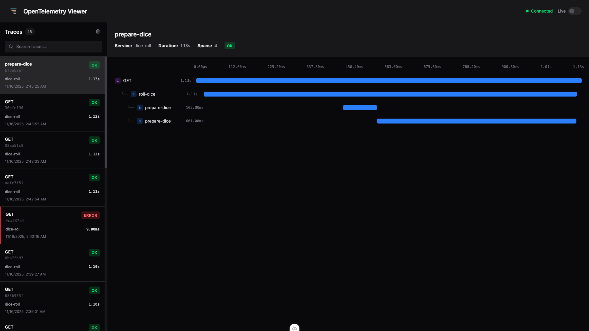

<p align="center">
  
</p>

<h1 align="center">OpenTelemetry Viewer</h1>

<p align="center">
  A real-time OpenTelemetry trace visualizer built with Nuxt 3 and Vue 3. View and debug traces from your instrumented applications with an intuitive waterfall visualization.
</p>

<p align="center">
  
</p>

<p align="center">
  <a href="docs/screenshots/otel-viewer-hero-shot.png">Full Interface</a> • 
  <a href="docs/screenshots/otel-viewer-error-trace-waterfall.png">Errors</a> • 
  <a href="docs/screenshots/otel-viewer-span-details-panel.png">Span Details Panel</a>
</p>

## Features

- 🔄 Real-time trace updates via WebSocket
- 📊 Waterfall visualization of spans
- 🔍 Detailed span information panel
- 📋 Live log monitoring with OTLP support
- 🎨 Clean, modern UI inspired by Sentry
- 💾 SQLite storage with Node.js 24 native support
- 🚀 OTLP-compatible HTTP endpoints
- ⚡ Fast and lightweight

## Requirements

- Node.js >= 24.0.0
- pnpm (or npm/yarn)

## Installation

```bash
# Install dependencies
pnpm install

# Start development server
pnpm dev
```

The application will be available at http://localhost:3000

## Sending Traces and Logs

The viewer accepts OTLP (OpenTelemetry Protocol) data via HTTP/JSON at:

**Traces:**
```
POST http://localhost:3000/api/v1/traces
```

**Logs:**
```
POST http://localhost:3000/api/v1/logs
```

**Note:** Use the HTTP/JSON exporter (not protobuf) from your application.

### Configuration in Your Application

Configure your OpenTelemetry HTTP exporter to send traces to the viewer:

#### Node.js Example (JSON - easier to debug)

```javascript
const { NodeSDK } = require('@opentelemetry/sdk-node');
const {
  OTLPTraceExporter,
} = require('@opentelemetry/exporter-trace-otlp-http');
const {
  getNodeAutoInstrumentations,
} = require('@opentelemetry/auto-instrumentations-node');

const sdk = new NodeSDK({
  traceExporter: new OTLPTraceExporter({
    url: 'http://localhost:3000/api/v1/traces',
    headers: {},
  }),
  instrumentations: [getNodeAutoInstrumentations()],
});

sdk.start();
```

#### Node.js Example (Protobuf - more efficient)

```javascript
const { NodeSDK } = require('@opentelemetry/sdk-node');
const {
  OTLPTraceExporter,
} = require('@opentelemetry/exporter-trace-otlp-proto');
const {
  getNodeAutoInstrumentations,
} = require('@opentelemetry/auto-instrumentations-node');

const sdk = new NodeSDK({
  traceExporter: new OTLPTraceExporter({
    url: 'http://localhost:3000/api/v1/traces',
    headers: {},
  }),
  instrumentations: [getNodeAutoInstrumentations()],
});

sdk.start();
```

#### Python Example

```python
from opentelemetry import trace
from opentelemetry.exporter.otlp.proto.http.trace_exporter import OTLPSpanExporter
from opentelemetry.sdk.trace import TracerProvider
from opentelemetry.sdk.trace.export import BatchSpanProcessor

trace.set_tracer_provider(TracerProvider())
tracer = trace.get_tracer(__name__)

otlp_exporter = OTLPSpanExporter(
    endpoint="http://localhost:3000/api/v1/traces",
)

span_processor = BatchSpanProcessor(otlp_exporter)
trace.get_tracer_provider().add_span_processor(span_processor)
```

## Usage

1. **Start the viewer**: Run `pnpm dev`
2. **Configure your app**: Point your OTLP exporters to:
   - Traces: `http://localhost:3000/api/v1/traces`
   - Logs: `http://localhost:3000/api/v1/logs`
3. **Generate data**: Run your instrumented application
4. **View traces**: Navigate to the Traces tab to see traces in real-time
5. **Inspect spans**: Click on a trace to see the waterfall view
6. **View logs**: Navigate to the Logs tab to see real-time log entries
7. **Expand logs**: Click on any log row to see the full message and attributes

## Features Overview

### Navigation

- Side navigation bar for switching between Traces and Logs views
- Real-time connection status indicator
- Live mode toggle for auto-selecting newest traces

### Trace List

- Shows all received traces
- Displays service name, operation, duration, and status
- Real-time updates as new traces arrive
- Error highlighting for failed traces

### Waterfall View

- Hierarchical span visualization
- Time-proportional span bars
- Depth-based color coding for easy hierarchy tracking
- Span kind badges (Server, Client, Internal, Producer, Consumer)
- Color-coded error spans
- Duration labels

### Span Details Panel

- Span metadata (ID, parent, kind, status)
- Attributes/tags
- Events with timestamps
- Linked spans
- Error messages

### Logs View

- Real-time log monitoring (last 500 logs)
- Expandable table rows for full message viewing
- Severity-based color coding (TRACE, DEBUG, INFO, WARN, ERROR, FATAL)
- Service name and timestamp display
- Trace/span correlation (stored for future use)
- Attributes viewing in expanded rows

### Clear Data

- Clear all stored traces with one click
- Resets both database and UI

## Architecture

- **Frontend**: Vue 3 with Composition API
- **Backend**: Nuxt Nitro server
- **Database**: SQLite (Node.js 24 native)
- **WebSocket**: Real-time updates using Nitro's WebSocket support
- **Protocol**: OTLP (OpenTelemetry Protocol) HTTP

## API Endpoints

### OTLP Endpoints
- `POST /api/v1/traces` - Receive OTLP traces
- `POST /api/v1/logs` - Receive OTLP logs

### Data Endpoints
- `GET /api/traces` - Fetch all traces
- `GET /api/traces/:traceId` - Fetch specific trace with spans
- `GET /api/logs` - Fetch all logs (last 500)
- `POST /api/traces/clear` - Clear all data

### Real-time
- `WS /_ws` - WebSocket for real-time updates

## Data Storage

All data is stored in SQLite at `.data/otel.db`. The database includes:

- **Traces table**: High-level trace information
- **Spans table**: Individual span data with attributes, events, and links
- **Logs table**: Log records with severity, service name, and optional trace/span correlation

## Development

```bash
# Start dev server
pnpm dev

# Build for production
pnpm build

# Preview production build
pnpm preview
```

## Credits

I vibe coded this whole thing, thanks Cursor.

## License

MIT
