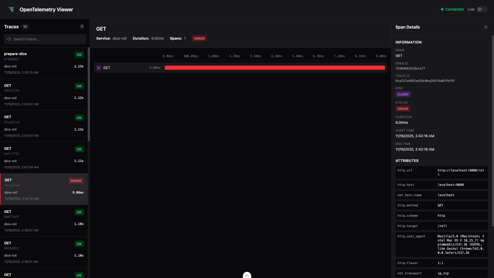

<p align="center">
  
</p>

<h1 align="center">Teley</h1>

<p align="center">
  A real-time viewer for traces, logs, and metrics. Point any OpenTelemetry or Sentry SDK at a room, watch your telemetry stream in live. In your browser or right in your terminal.
</p>

<p align="center">
  <a href="https://teley.dev"></a>
  <a href="https://www.npmjs.com/package/teley-cli"></a>
  
</p>

<p align="center">
  
</p>

<p align="center">
  <a href="#-get-started-in-under-a-minute">Quickstart</a> •
  <a href="#-send-your-data">Send data</a> •
  <a href="#-what-you-get">Features</a> •
  <a href="#-how-it-works">How it works</a> •
  <a href="#-self-host">Self-host</a>
</p>

---

Teley is a zero-setup, local-first observability dashboard. Every session gets its own private room with a unique DSN. Your app sends telemetry to that room, and you see it appear instantly. There is no account, no database to run, and no data leaving your machine beyond the live relay.

Two ways to use it, same room model:

- **Web** at [teley.dev](https://teley.dev) for the full dashboard: waterfall traces, logs, metrics, and side-by-side trace comparison.
- **Terminal** via `teley-cli` for a live waterfall without leaving your shell.

## ⚡ Get started in under a minute

### On the web

1. Open **[teley.dev](https://teley.dev)**. A private room is created for you instantly. No signup.
2. Click your **session ID** in the header to copy your DSN and OTLP endpoint.
3. Point your app's Sentry or OpenTelemetry SDK at it (see [Send your data](#-send-your-data)).
4. Run your app. Traces, logs, and metrics stream in live.

### In your terminal

```bash
bunx teley-cli          # live room, waterfall in your terminal
bunx teley-cli --demo   # sample data, no network, see it instantly
```

The DSN is printed in the header. Point your SDK at it, run your app, and watch spans arrive.

> Requires [Bun](https://bun.sh). The CLI's renderer uses `bun:ffi`, so run it with `bunx`, not `npx`.

## 📡 Send your data

Teley speaks two protocols out of the box. Both point at the same room. Swap in the session ID from the header (`<room-id>` below).

### Sentry SDK

Set your DSN. The project ID at the end can be anything.

```javascript
import * as Sentry from '@sentry/browser';

Sentry.init({
  dsn: 'https://<room-id>@teley.dev/0',
  tracesSampleRate: 1.0,
  integrations: [Sentry.browserTracingIntegration()],
});
```

Sentry transactions become traces and errors become logs, converted to OTLP automatically. They show up tagged with a `SENTRY` badge.

### OpenTelemetry (OTLP over HTTP/JSON)

Export to `https://teley.dev/r/<room-id>`:

```javascript
import { OTLPTraceExporter } from '@opentelemetry/exporter-trace-otlp-http';
import { NodeTracerProvider } from '@opentelemetry/sdk-trace-node';
import { SimpleSpanProcessor } from '@opentelemetry/sdk-trace-base';

const provider = new NodeTracerProvider();
provider.addSpanProcessor(
  new SimpleSpanProcessor(
    new OTLPTraceExporter({ url: 'https://teley.dev/r/<room-id>' }),
  ),
);
provider.register();
```

> Use the HTTP/JSON exporter (`-otlp-http`), not protobuf.

<details>
<summary>Python, and pointing at a local worker</summary>

**Python (OTLP)**

```python
from opentelemetry import trace
from opentelemetry.sdk.trace import TracerProvider
from opentelemetry.sdk.trace.export import SimpleSpanProcessor
from opentelemetry.exporter.otlp.proto.http.trace_exporter import OTLPSpanExporter

provider = TracerProvider()
provider.add_span_processor(
    SimpleSpanProcessor(OTLPSpanExporter(endpoint="https://teley.dev/r/<room-id>"))
)
trace.set_tracer_provider(provider)
```

**Endpoints per room**

| Purpose     | Endpoint                        |
| ----------- | ------------------------------- |
| Sentry DSN  | `https://<room-id>@teley.dev/0` |
| OTLP ingest | `https://teley.dev/r/<room-id>` |

Running your own worker? Swap `teley.dev` for your host, or use `teley-cli --host localhost:8787` for the CLI.

</details>

## ✨ What you get

- **Waterfall traces.** Time-proportional span bars with a real hierarchy, span-kind badges (server/client/internal/producer/consumer), and color-coded errors.
- **Span details.** ID, parent, kind, status, timing, attributes, events, and links. One click from any span.
- **Live logs.** Real-time stream with severity coloring (`TRACE` through `FATAL`), expandable rows, and trace/span correlation.
- **Metrics.** Counters, gauges, histograms, and sets, charted as they arrive.
- **Trace comparison.** Line up two traces side by side. Teley aligns spans with an LCS diff and highlights the differences in structure, duration, and attributes.
- **Two protocols, one view.** OTLP and Sentry envelopes land in the same unified timeline.
- **Local-first.** Everything is stored in your browser's IndexedDB. Rooms are private and ephemeral.
- **Live mode.** Auto-select the newest trace as it arrives, so the latest activity is always in front of you.

<p align="center">
  
</p>

<details>
<summary>CLI keyboard shortcuts</summary>

| Key                      | Action                                        |
| ------------------------ | --------------------------------------------- |
| `←` / `→`                | Switch between Traces and Logs                |
| `↑` / `↓` (or `j` / `k`) | Navigate the focused panel                    |
| `tab`                    | Cycle focus: list → detail → connection links |
| `↵` / `y`                | Copy the focused DSN or OTLP endpoint         |
| `c`                      | Clear the local view                          |
| `q`                      | Quit                                          |

Run `teley --help` for all flags (`--host`, `--new`, `--demo`).

</details>

## 🔌 How it works

```
Your app  ──OTLP / Sentry──▶  Cloudflare Worker  ──▶  TelemetryRoom (Durable Object)
                                                              │  WebSocket broadcast
                                                              ▼
                                              Web dashboard  +  teley-cli
                                              (IndexedDB)       (terminal)
```

Each room is a Durable Object holding a WebSocket fan-out. The first client claims the room with a receive token; ingest is keyed by room ID. The web app and the CLI are both just relay clients rendering the same stream. Nothing is persisted server-side beyond the live room (shared trace snapshots are the one exception, kept for 24 hours).

<details>
<summary>Tech stack</summary>

- **Web:** Nuxt 4 (Vue 3 + TypeScript, SSR off), Tailwind CSS v4, Unovis charts, Dexie (IndexedDB), a `SharedWorker` for one WebSocket across tabs.
- **CLI:** [OpenTUI](https://opentui.com) (React bindings) on Bun. Reuses the shared parsers and the web app's `buildSpanTree`.
- **Backend:** Cloudflare Workers + Durable Objects.
- **Shared:** framework-agnostic OTLP and Sentry parsers in `shared/parsers/`, used by the worker, web app, and CLI alike.

</details>

## 🛠 Self-host

Teley is a pnpm monorepo: `web/` (dashboard), `cli/` (terminal viewer), `workers/` (Cloudflare relay), plus shared `shared/` and `types/`.

```bash
pnpm install

# Web dashboard
cd web && pnpm dev            # http://localhost:3000

# Relay worker (separate terminal)
cd web && pnpm dev:worker     # http://localhost:8787

# CLI against your local worker
cd cli && bun install
bun run dev --host localhost:8787
```

Deploy the worker with `pnpm deploy:worker` and the static site with `pnpm deploy:static` (both from `web/`).

## License

[Apache 2.0](LICENSE). See [NOTICE](NOTICE) for attribution requirements.
